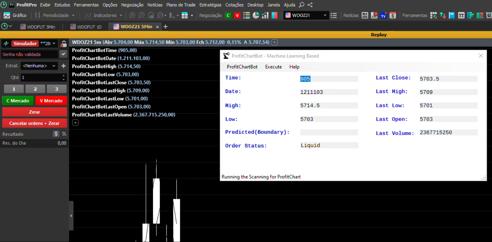
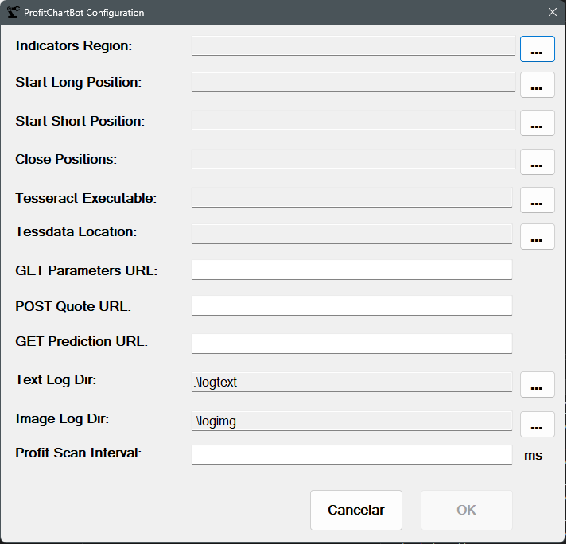

# ProfitChartBot

The main motivation for these project is the lack of an affordable api from nelogica in order to receive real time quotes from B3 exchange and then route orders to the exchange.

It works by scraping and doing an Screen OCR of the ProfitChart screen as we can see below and then sending the clicks via windows API to the buy / sell / close buttons



We can see above that the system will scrap the screen, get the quotes, then will send to the ML Model hosted by the [pyAutoTradingBot](https://github.com/gbencke/pyAutoTradingBot) API and it will return a score that will determine a long short position. In case of a signal, it will send a click to the desktop interface.

# Configuration

In order for the system to work properly, it is necessary to configure it. Please click in the configuration menu item in the system menu to display the configuration window:




* **Indicators Region**: A
* **Start Long Region**: A
* **Start Short Region**: A
* **Close Positions**: A
* **Tesseract Executable**: A
* **Tessdata Location**: A
* **GET Parameters URL**: A
* **POST Quote URL**: A
* **GET Prediction URL**: A
* **Text Log Dir**: A
* **Image Log Dir**: A
* **Profit Scan Interval**: A


```diff
- This repo is deprecated, 
- as Nelogica has a new realtime quote / order routing API that is very affordable, 
- I strongly suggest using it instead of this project.
```
